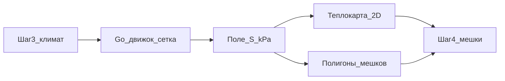

# План корректировок шага 4 «Мешки и датчики»

> Локальная копия плана в репозитории. Спецификация алгоритма: [calculator-wind-rose-heatmap.md](../../calculator-wind-rose-heatmap.md).
>
> **Статус:** реализовано (2026-06-18). Стек Vue + Go без изменений.

## Контекст

Корректируем **шаг 4 в Vue** (`id: 'bags'`) — [web/src/types/index.ts](../../web/src/types/index.ts). Расчёт запускается на шаге 3 («Ориентация и климат»), результат и визуализация — на шаге 4.



## Расхождения: сейчас vs спецификация

| Аспект | Сейчас | По calculator-wind-rose-heatmap.md |
|--------|--------|-------------------------------------|
| Выход API | Только `snowbags[]` | `loadGrid` + `grid[]` с `value_kpa` |
| Парапеты | Полоса 6.7 м, μ 1.4–1.8, B.13 | **Б.16**: μ_max = min(2h/S₀, 3), b = 2h, h > S₀/2 |
| Ветер | 8 секторов СНиП, вес ≥ 7 | Преобладающий азимут → `local_wind = wind_deg - north_deg` |
| Формула S | `ce × ct × μ × Sg` | `0.7 × ce × ct × μ × Sg` (СП 20, п. 10.1) |
| Шаг 4 UI | Полигоны SVG + 3D-сугробы | Canvas LoadHeatmap по кПа |
| Панель | `<ul>` | `BagCard` + чипы риска (макет StepSnowbags) |

**Без изменений на этом этапе:** роза ветров из СНиП (8 направлений, январь); Open-Meteo не переносим.

## Задачи

| ID | Задача | Файлы | Статус |
|----|--------|-------|--------|
| grid-engine | Сетка + Б.16 + `loadGrid` в ответе | `api/internal/analytics/grid_engine.go`, `sp_drift.go`, `model/project.go`, `engine.go` | done |
| zones-from-grid | Зоны из μ-поля + вогнутые углы | `snowbags.go`, `zones.go` | done |
| api-wind-input | `windDirectionDeg` в запросе расчёта | `model/project.go`, `handler.go`, `WizardView.vue` | done |
| load-heatmap-ui | LoadHeatmap + слой на canvas | `LoadHeatmap.vue`, `WizardView.vue` | done |
| bag-card-panel | BagCard + панель шага 4 | `BagCard.vue`, `WizardView.vue` | done |
| tests-golden | Тесты и формула 0.7 | `snowbags_test.go`, `engine.go` | done |

## 1. Backend: сеточный движок

Новые файлы в `api/internal/analytics/`:

- `sp_drift.go` — `sp20BaseLoad`, `windFromVector`, `driftParameters`, `isWindwardEdge`, треугольный μ
- `grid_engine.go` — `buildGrid`, `calculateLoadGrid`

Логика:

1. Сетка по кровли, `cell_size` ≈ 0.25 м (`metersPerPixel` из `areaM2`).
2. `S_base = 0.7 * ce * ct * Sg` (μ=1 на плоской кровле).
3. Дрифт Б.16 по рёбрам с `sideParapets[i]` (добавить поле в Go `GeometryData` — сейчас есть только во фронте).
4. Дрифт за препятствиями по подветренным сегментам bbox.
5. Ответ: `LoadGrid` в `CalculationResult`.

```go
// model/project.go — новые типы
type LoadGrid struct {
    Grid                  []GridCell `json:"grid"`
    Width, Height         int
    CellSizeM             float64    `json:"cell_size_m"`
    MinValueKpa, MaxValueKpa float64
    Bounds                GridBounds `json:"bounds"`
    WindDirectionDeg      float64
    LocalWindDirectionDeg float64
    NorthDirectionDeg     float64
}
```

Ветер: `WindDirectionDeg` из `Prevailing.Deg` (climate_db), `local = wind - northDeg`.

## 2. Backend: зоны мешков

Переработать [snowbags.go](../../api/internal/analytics/snowbags.go):

- Парапеты: полосы глубиной `b = 2h`, μ по Б.16 (или контур из сетки где μ > 1.05).
- Препятствия: подветренные зоны + схемы B.12/B.14 по типу.
- Вогнутые углы (п. 10.4): без изменений логики.
- `snowLoadStr` / `maxS`: коэффициент **0.7**.
- Схема парапетов: **B.16** вместо B.13.

Удалить/не использовать калибровочные константы `parapetStripDepthM = 6.7` после перехода на Б.16.

## 3. Frontend: тепловая карта

- `web/src/components/LoadHeatmap.vue` — Canvas, градиент кПа, clip по контуру, легенда.
- `RoofCanvas.vue` — слой `heatmap`, переключатель **Нагрузка / Зоны / Оба**.
- `CalculationData.loadGrid` в types.

Координаты сетки: метры (x/y ячеек × `mpp` от px-геометрии).

## 4. Frontend: панель шага 4

По макету [standalone-src.html](../../ТехноНИКОЛь%20TN%20Design%20System%20(3)/ui_kits/snow/standalone-src.html) `StepSnowbags`:

- `BagCard.vue` — id, имя, μ, S, площадь, basis, тег риска.
- Заголовок «Зоны снегонакопления», тег СП 20.13330.
- Ручные мешки — пометка «корректировка»; при пересчёте с шага 3 — **перезапись авто-зон** (ручные сбрасывать или сохранять отдельно — зафиксировать в UI).

## 5. Связь шаг 3 → 4

В `runCalculate()` ([WizardView.vue](../../web/src/views/WizardView.vue)):

```ts
windDirectionDeg: climatePreview?.prevailing?.deg
  ?? climatePreview?.windRose?.reduce((a, b) => b.v > a.v ? b : a)?.deg,
geometry: { ...geometry, sideParapets },
```

Расширить `CalculateRequest` и handler.

## Порядок внедрения

1. Go: сетка + Б.16 + `loadGrid` (тесты API).
2. `buildSnowbags` на Б.16 + prevailing wind.
3. `windDirectionDeg` в API и WizardView.
4. `LoadHeatmap.vue` + canvas.
5. `BagCard` + панель.
6. Golden-тесты на DEMO_GEOMETRY.

## Критерии готовности

- Теплокарта кПа в 2D на шаге 4.
- Парапетные зоны с подветренной стороны преобладающего ветра.
- `metrics.maxLoad = 1.4 × max(0.7·ce·ct·μ·Sg)`.
- Пересчёт с шага 3 обновляет `loadGrid` и `snowbags`.

## Риски

- `sideParapets` добавлен в Go `GeometryData`.
- `areaM2` на шаге 2 критичен для `mpp`.
- Б.11 (перепады высот) — вне scope.
- Ручные мешки vs авто-зоны при пересчёте.

## Чеклист для разработчика

- [x] `GeometryData.sideParapets` в Go
- [x] `sp_drift.go` + `grid_engine.go`
- [x] `LoadGrid` в `CalculationResult`
- [x] `buildSnowbags` + формула 0.7
- [x] `windDirectionDeg` end-to-end
- [x] `LoadHeatmap.vue`
- [x] `BagCard.vue`
- [x] `snowbags_test.go` обновлён
